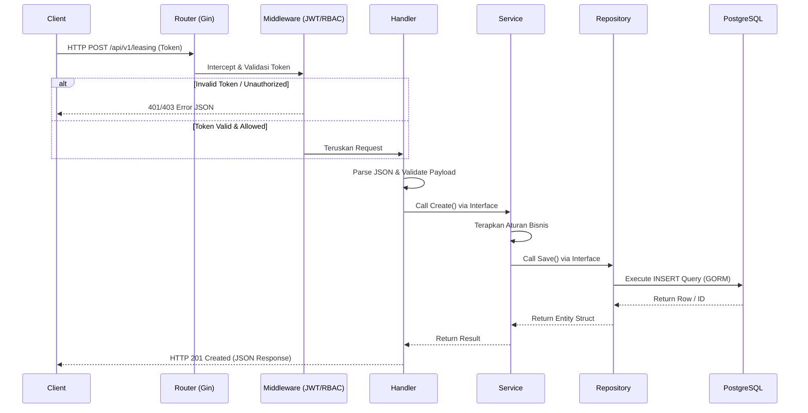
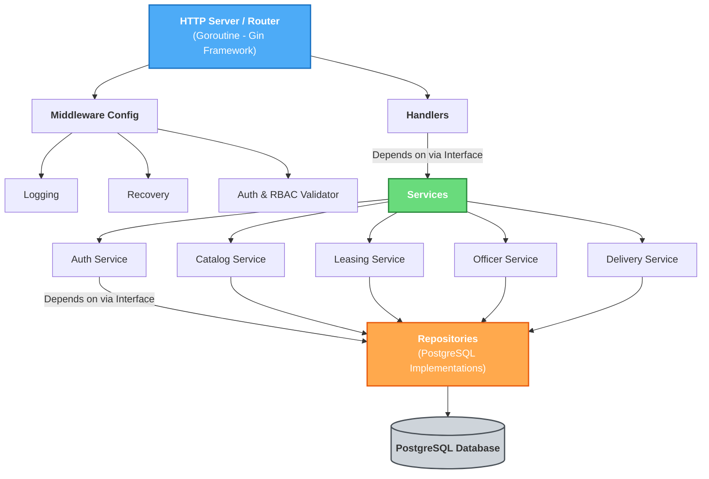

# System Architecture: Honda Leasing API

## 1. Pola Arsitektur yang Diterapkan

Proyek Honda Leasing API menggunakan pola **Layered Architecture** dengan sedikit sentuhan **Clean Architecture**. Sistem difokuskan untuk memecah secara jelas tanggung jawab dari masing-masing lapisan, sehingga memudahkan *testing*, *maintenance*, dan meminimalisir saling silang dependensi antar komponen (Low Coupling, High Cohesion). Pemisahan fungsional juga ditata dengan gaya **Modular Monolith**, di mana fitur dipisah per *domain/bussiness unit*, seperti `auth`, `catalog`, `leasing`, `delivery`, dan `officer`.

Setiap domain utamanya terbagi atas tiga lapisan inti:
1. **Handler Layer (Presentation):**
   - Bertugas menerima request HTTP dari pengguna (berupa JSON, Path Params, atau Query Params).
   - Memvalidasi bentuk data input menggunakan library `go-playground/validator`.
   - Mengubah struktur data input ke struktur yang dikenali lapisan Service, kemudian memanggil Service.
   - Mengembalikan response HTTP (berupa JSON atau error handling seragam) ke *client*.
2. **Service Layer (Business Logic):**
   - Jantung dari setiap modul. Di sini seluruh perhitungan, pengecekan, atau aturan bisnis didefinisikan secara khusus (e.g. validasi apakah customer dilarang mengajukan leasing dua kali, dsb.).
   - Service tidak peduli apakah data datang dari HTTP, gRPC, maupun *event broker*. 
   - Memanggil fungsionalitas di lapisan bawahnya yaitu Repository.
3. **Repository Layer (Data Access):**
   - Menangani perihal koneksi dan eksekusi query ke dalam bentuk persisten (Database PostgreSQL).
   - Seluruh detail teknis terkait ORM GORM berada di lapisan ini. Service tidak perlu tahu query SQL apa yang dieksekusi, ia cukup menerima atau mengirim data utuh (murni struct Go).

## 2. Diagram Alur (Data Flow)

Berikut adalah diagram alur secara keseluruhan yang merepresentasikan pola Request-Response sederhana dalam sistem aplikasi ini:

## 3. Komponen-Komponen Sistem (Component Relations)

Terdapat berbagai macam komponen dalam sistem ini yang dirakit menjadi satu kesatuan fungsional menggunakan **Google Wire**:

**Penjelasan Hubungan:**
1. **API Router (`gin-gonic/gin`)** akan menugaskan setiap jalur endpoint kepada `Handler` yang berkaitan. Jalur (Routes) diiringi dengan filter khusus dari `Middleware`, seperti blokade akses jika *role* tidak sesuai dengan peruntukan rute (RBAC).
2. **Handlers** tidak membuat sendiri instansi `Service`, hal ini diinjeksi (*Dependency Injection*) saat fase kompilasi oleh **Google Wire**. Handler hanya berinteraksi dengan Service menggunakan kontrak *Interface*.
3. **Services** melakukan perhitungan inti atau menyusun data lintas entitas, dan memanggil fungsi interface dari `Repository`.
4. Secara keseluruhan, ketergantungan mengarah "ke dalam", lapisan terdalam (Service dan Repository Interface) terisolasi dari detail framework (seperti representasi context dari Gin).
